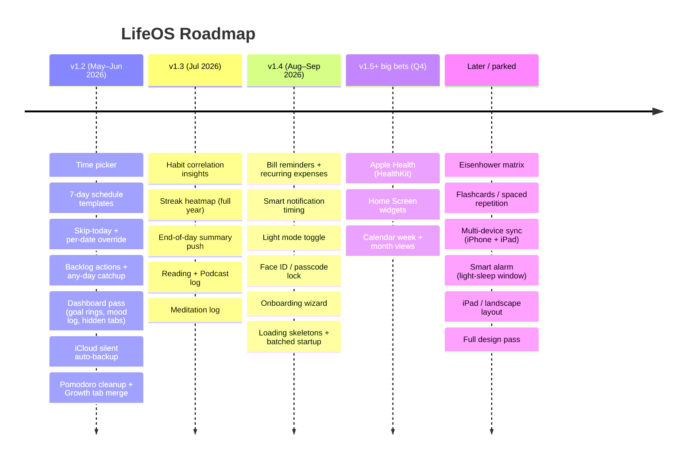

# LifeOS — Roadmap

The single source of truth for what ships next, what's planned, and what's been parked.

> **Legend**
> Priority: 🔴 Critical · 🟠 High · 🟡 Nice-to-have · 🔵 Big bet
> Status: `[ ]` todo · `[~]` in progress · `[x]` done · `[-]` skipped/parked
>
> Convert relative dates to absolute when adding entries. Keep priorities honest — if everything is high, nothing is.

---

## 0. Where we are today

- **Current release:** v1.1.0 (Android sideload via GitHub Releases; EAS Update enabled for OTA JS pushes)
- **Stack:** Expo ~54 + React Native 0.81 + Expo Router (file-based tabs) + AsyncStorage (no backend)
- **Tabs:** Dashboard · Schedule · Fitness · Learning · Skills · Journal · Finance · Analytics · Alarms · Settings (+ Pomodoro modal — on the kill list, see §4)
- **Distribution:**
  - Android: signed APK on GitHub Releases, OTA via EAS Update channel `production`
  - iOS: dev / Xcode archive only (no public distribution — and no plan to change that, see §1)
- **Storage:** local-only AsyncStorage. JSON export from Settings. No iCloud yet, no sync.

---

## 1. North-star vision

A fully local, privacy-first life tracker for **one person** — me — that captures everything that matters in one place: habits, schedule, fitness, learning, skills, journal, finance, analytics. Built first for daily personal use. Generic-enough defaults so the source code is shareable, but **no Play Store, no App Store, no support promise**.

Three things must always be true:

1. **Single-glance Dashboard** — open the app and see today.
2. **Zero-friction logging** — tap counts more than typing.
3. **Local-first, exportable** — your data is yours, in JSON, anytime.

**Audience:** just me. **Platform priority:** iOS-first (daily driver — unlocks iCloud, HealthKit, WidgetKit, Dynamic Island). Android keeps shipping but can run a release behind on iOS-only features.

---

## 2. The v1.2 plan (next ~6 weeks)

### At a glance



> Renders natively on GitHub, in VS Code with the Mermaid extension, and at [mermaid.live](https://mermaid.live). Edit text → diagram updates.

**Theme: Fix daily friction + lock down data safety.** ~30 engineering hours at 5–10 hrs/week.

| Order | Block | Est | Notes |
|---|---|---|---|
| 1 | Time picker wheel — replace HH:MM text input | ~2h | Smallest, biggest daily payoff. Use `@react-native-community/datetimepicker` with native iOS spinner. |
| 2 | 7-day schedule templates (Mon–Sun) | ~4h | Migration: copy `schedule_weekday` → Mon–Fri, keep `schedule_saturday/sunday` as is. New keys: `schedule_mon`…`schedule_sun`. Keep old keys readable for one release as fallback. |
| 3 | "Skip today only" + per-date override | ~4h | New key `scheduleOverride_{YYYY-MM-DD}` storing diffs from template. UI: long-press task → "Skip today" or "Edit just today". |
| 4 | Backlog actions ("Carry to tomorrow" / "Dismiss") + any-day catchup | ~4h | Replace Sunday-only logic. Catchup view shows past 7 days of incomplete. Carry → adds task to tomorrow's override. |
| 5 | Dashboard pass: surface hidden tabs + goal progress rings + quick mood log | ~6h | Three small wins shipped together. Mood writes to `journal_{date}.mood`. Hidden-tab shortcuts as icon row. Goal rings reuse existing chart-kit. |
| 6 | iCloud auto-backup on background (silent, no UI) | ~8h | iOS-only. JSON dump to iCloud Drive `LifeOS/backup-latest.json` on `AppState` → background. On fresh install, detect file and restore. No UI; if it fails, silent. |
| 7 | Cleanup: hide Pomodoro modal, merge Study + Skills → "Growth" tab | ~2h | Tab bar drops from 10 → 9 (or fewer if more demoted later). Keep Skills/Learning data — just one tab surface. |

Buffer: ~0h. Tight. If something slips, push the iCloud block to v1.2.1 — never push items 1–4.

**v1.3 candidates** (whichever fits time): light mode toggle, onboarding wizard (still nice for personal-fresh-install), streak heatmap, habit correlation insights, reading/podcast + meditation logs (see §4).

---

## 3. Top 10 — current ranking (re-ranked from your input)

| # | Task | Why |
|---|---|---|
| 1 | Time picker (replace HH:MM input) | You named it #1 daily pain |
| 2 | 7-day schedule templates | Tuesday ≠ Thursday |
| 3 | "Skip today only" on tasks | Daily friction every time you adjust |
| 4 | Per-date schedule override | Travel / sick days |
| 5 | Carry-to-tomorrow / Dismiss on backlog | Backlog goes from useless → useful |
| 6 | Surface Finance / Journal / Analytics on Dashboard | Tabs are invisible today |
| 7 | Weekly goal progress rings on Dashboard | Goals you set but never see |
| 8 | Quick mood log on Dashboard | One-tap vs Journal navigate |
| 9 | iCloud auto-backup | The 🔴 we shouldn't defer further |
| 10 | Habit correlation insights | First insight that earns Analytics tab |

Items 1–9 are the v1.2 plan. #10 lands in v1.3.

---

## 4. Full backlog by area

### 🗓 Calendar & Schedule
**Bugs / Core fixes**
- [ ] 🔴 Time input is raw HH:MM — replace with native time picker wheel **(v1.2 #1)**
- [ ] 🔴 Schedule edits save to the DAY-TYPE template forever — add "just today" vs "always" choice **(v1.2 #3)**
- [ ] 🔴 Missed-task backlog is view-only — add "Carry to tomorrow" + "Dismiss" **(v1.2 #4)**
- [ ] 🔴 Catchup view only loads on Sundays — make available any day **(v1.2 #4)**

**New features**
- [ ] 🟠 7-day templates — Mon–Sun individually **(v1.2 #2)**
- [ ] 🟠 Per-date schedule override **(v1.2 #3)**
- [ ] 🟠 Day-type tags — Rest / Travel / Sick / Holiday / Study, auto-select template *(v1.3+)*
- [ ] 🟠 "What's tomorrow" preview at the bottom of Dashboard *(v1.3+)*
- [ ] 🟠 Long-press Dashboard schedule card → edit today's tasks *(v1.3+)*
- [ ] 🔵 Week view — horizontal 7-day strip, density per day *(later)*
- [ ] 🔵 Month calendar view — tap any date to see/edit tasks *(later)*
- [ ] 🔵 Template library — Morning Person / WFH / Travel etc. *(later)*
- [ ] 🟡 Holiday/public-holiday awareness *(later)*
- [ ] 🟡 "Planning mode" — view/edit next 7 days before week starts *(later)*

### 📋 Tasks & Productivity
- [ ] 🟠 Priority levels (High/Med/Low + colour) *(v1.3+)*
- [ ] 🟠 Swipe gestures — swipe right = complete, left = delete *(v1.3+)*
- [ ] 🟠 Task notes / description *(v1.3+)*
- [ ] 🟠 Drag to reorder manual tasks *(later)*
- [ ] 🟡 Sub-tasks / checklist *(later)*
- [ ] 🟡 Time estimate vs actual + stopwatch *(later)*
- [ ] 🟡 Recurring manual tasks ("every Monday") *(later)*
- [ ] 🔵 Eisenhower matrix view *(later)*
- [ ] 🔵 Task search across all days *(later)*
- [-] Focus mode — depends on Pomodoro which is on the kill list *(parked)*

### 🏠 Dashboard
- [ ] 🟠 Weekly goal progress rings **(v1.2 #5)**
- [ ] 🟠 Quick mood log (😞😐😄 → journal) **(v1.2 #5)**
- [ ] 🟠 Navigation shortcuts to Finance / Journal / Analytics **(v1.2 #5)**
- [ ] 🟠 "Next up" card — next 1–2 tasks within 60 min *(v1.3+)*
- [ ] 🟡 Daily motivational quote in greeting *(later)*
- [ ] 🟡 Energy-level tracker — 1–5 morning check-in *(later)*
- [ ] 🟡 Mini week strip (7-day ✓/○ row) *(later)*
- [ ] 🔵 Customisable Dashboard — reorder/hide sections *(later)*

### 📊 Analytics & Insights
- [ ] 🟠 Habit correlation engine ("On 7+ hr sleep nights, habits +X%") **(v1.3 candidate)**
- [ ] 🟠 Streak calendar — full-year heatmap **(v1.3 candidate)**
- [ ] 🟠 Goal vs actual chart — weekly bars per goal *(v1.4+)*
- [ ] 🟡 Weekly review screen (Sunday prompt) *(later)*
- [ ] 🟡 Monthly report screen — auto summary *(later)*
- [ ] 🟡 Personal bests *(later)*
- [ ] 🟡 Share progress card — image *(later)*
- [ ] 🔵 Prediction nudges *(later)*
- [ ] 🔵 Export to PDF *(later)*

### 💪 Fitness
*(Confirmed daily-essential: weight, sleep, meals, deviations, cigs.)*
- [ ] 🟠 Sleep quality rating (1–5 stars, not just hours) *(v1.3+)*
- [ ] 🟠 Workout log — exercise / sets / reps / weight *(v1.3+)*
- [ ] 🟠 Body measurements — waist / chest / arms *(v1.3+)*
- [ ] 🟡 Water reminder push (covered by Notifications, smart cadence) *(v1.4+)*
- [ ] 🟡 Meal nutrition — calorie / macro tracking *(later)*
- [ ] 🟡 Diet deviation insights — most frequent types *(later)*
- [ ] 🔵 Apple Health integration (HealthKit: steps / sleep / workouts / weight) *(v1.5 big bet)*
- [ ] 🔵 Running / walking GPS route logging *(later)*

### 🎯 Growth (Learning + Skills, merged tab)
*(Decision: Study + Skills aren't daily-essential — merging into one tab in v1.2 #7.)*
- [ ] 🟠 Merge `learning.tsx` + `skills.tsx` into `growth.tsx` **(v1.2 #7)** — keep both data shapes; one tab UI with two sub-sections.
- [ ] 🟠 Practice / session notes (free-text on log entries) *(v1.3+)*
- [ ] 🟠 Resource links per course / per skill *(v1.3+)*
- [ ] 🟠 Skill-level progression chart (1–10 over time) *(v1.3+)*
- [ ] 🟠 Per-skill streak counter *(v1.3+)*
- [ ] 🟡 Reading / book tracker — title, pages, target finish *(v1.3+ — see new "Reading & Listening" below)*
- [ ] 🟡 Built-in metronome (Guitar) *(later)*
- [ ] 🟡 Course completion milestones *(later)*
- [ ] 🟡 Study session insights — best time of day *(later)*
- [ ] 🔵 Flashcards / spaced repetition *(later)*
- [ ] 🔵 Safari share extension → Growth resources *(later)*
- [ ] 🔵 Voice/video session recording *(later)*

### 📖 Reading & Listening *(new section — added from 1:1)*
- [ ] 🟠 Reading log — title + minutes + optional notes per session
- [ ] 🟠 Podcast log — same shape, separate tag
- [ ] 🟡 Aggregate weekly chart (minutes by source)
- [ ] 🟡 "Currently reading" pin on Dashboard

Likely lives inside Growth tab as a third sub-section.

### 🧘 Mind *(new section — added from 1:1)*
- [ ] 🟠 Meditation / breathwork log — duration + technique
- [ ] 🟠 Streak counter
- [ ] 🟡 Optional in-app timer (replaces some of the deleted Pomodoro work)
- [ ] 🟡 Mood pre/post comparison

Could live as a card on Dashboard or a small section in Journal.

### 💰 Finance
*(Confirmed daily-essential: expense logging.)*
- [ ] 🟠 Income tracking + net cashflow *(v1.3+)*
- [ ] 🟠 Recurring expenses — monthly auto-create *(v1.3+)*
- [ ] 🟠 Bill reminders — due date + 2-day-before push *(v1.4+, paired with Notifications)*
- [ ] 🟠 Month-over-month comparison *(later)*
- [ ] 🟡 Savings goals — target + date *(later)*
- [ ] 🟡 Receipt photo *(later)*
- [ ] 🟡 Multi-currency *(later)*
- [ ] 🔵 Investment portfolio tracker *(later)*

### 📓 Journal
*(Confirmed daily-essential.)*
- [ ] 🟠 Mood trend graph — last 30 days inline *(v1.3+)*
- [ ] 🟠 Journal streak counter *(v1.3+)*
- [ ] 🟠 Search journal entries *(v1.3+)*
- [ ] 🟠 Gratitude section — 3 lines *(v1.3+)*
- [ ] 🟡 Tags (#travel #milestone) *(later)*
- [ ] 🟡 Weekly journal prompts *(later)*
- [ ] 🟡 Photo attachment (1–3) *(later)*
- [ ] 🔵 Voice memo *(later)*

### 🔔 Notifications & Alarms
*(Decision: smart cadence — milestones + EOD + smart timing. Cap ~3–4/day.)*
- [ ] 🟠 End-of-day summary @ 9 PM ("X/Y tasks, X/Y habits") *(v1.3 — first notif feature)*
- [ ] 🟠 Streak milestone notifications (7 / 30 / 100 days) *(v1.3+)*
- [ ] 🟠 Smart timing — skip gym reminder if sleep log shows still in bed *(v1.4+)*
- [ ] 🟠 Better alarm music picker — device playlists vs Spotify URI paste *(v1.4+)*
- [ ] 🟡 Lock-screen widget (water / habits / streak) *(v1.5 big bet)*
- [ ] 🟡 App-icon badge — pending habits *(later)*
- [ ] 🟡 Dynamic Island Pomodoro **DROP** — Pomodoro on kill list
- [ ] 🟡 Bill due-date reminders (depends on Finance bill feature) *(later)*
- [ ] 🔵 Smart alarm (light-sleep wake window) *(later)*

### ☁️ Data & Backup
- [ ] 🔴 iCloud auto-backup on app background (silent, no UI) **(v1.2 #6)** — JSON to `iCloud Drive/LifeOS/backup-latest.json`. Auto-restore on fresh install if file detected.
- [ ] 🟠 Better import UI — file picker (vs share-sheet) *(v1.3+)*
- [ ] 🟡 Versioned snapshots — keep last N backups *(v1.4+)*
- [ ] 🟡 Selective restore (habits only, finance only…) *(later)*
- [ ] 🟡 Versioned schema / data migration system *(write up before v1.3 starts adding new keys aggressively)*
- [ ] 🔵 Multi-device sync (iPhone + iPad) *(later)*

### 🎨 UI / UX
- [ ] 🟠 Light mode toggle *(v1.3 candidate — not yet committed)*
- [ ] 🟠 Face ID / passcode lock *(v1.3+)*
- [ ] 🟠 Onboarding wizard *(v1.4+ — even just-me benefits on fresh install)*
- [ ] 🟠 Empty states — illustrations + actions on empty screens *(later)*
- [ ] 🟡 Haptic feedback (habit toggle, task complete) *(later)*
- [ ] 🟡 Tab customisation — reorder/hide *(later)*
- [ ] 🟡 App-icon variants *(later)*
- [ ] 🔵 iPad / landscape layout *(later)*
- [ ] 🔵 Home Screen widgets (WidgetKit) *(v1.5 big bet — iOS-first leverage)*
- [ ] 🔵 Full design pass — typography, spacing, palette *(later — open to it but not now)*

### ⚙️ Performance & code health
- [ ] 🟠 Loading skeletons (vs blank screens) *(v1.4+)*
- [ ] 🟠 Batched startup — single AsyncStorage `multiGet` *(v1.4+ — pairs with schema migration work)*
- [ ] 🟡 Error boundaries — friendly screen crash UI *(later)*
- [ ] 🟡 Offline state detection (banner) *(later)*
- [ ] 🟡 Memory-leak audit — `useFocusEffect` cleanup *(later)*

### 🪦 Kill list
*(Things to remove or hide rather than improve.)*
- [ ] 🟠 Hide Pomodoro modal **(v1.2 #7)** — dozens of dedicated apps do this better. Keep code in one branch in case we want it back.
- [-] Focus mode (depended on Pomodoro)
- [-] Dynamic Island Pomodoro

---

## 5. Distribution & release

| Channel | Status | Notes |
|---|---|---|
| Android — sideload | ✅ live | Signed APK on GitHub Releases. Obtainium friendly. |
| Android — Play Store | ⛔ skip | Decision: just-me audience. No store listing. |
| iOS — sideload via Xcode | ✅ live | Daily driver. Rebuild via Xcode whenever native deps change. |
| iOS — TestFlight / App Store | ⛔ skip | Decision: just-me audience. Skip the $99/yr unless audience changes. |
| OTA — JS updates | ✅ live | EAS Update, channel `production`, runtime policy `appVersion`. |

### Release cadence (decided in 1:1: two-channel model)

- **Daily channel** = current `production` EAS channel. Push OTA the moment a feature works on your phone. Fast loop.
- **Stable releases** = monthly tagged versions (v1.2.0, v1.3.0…) with a written changelog in GitHub Releases. Bundle 4–6 features per release. The "stable" naming is aspirational right now (only your phone consumes it) but keeps the option open if you ever sideload to a friend.

If you want a hard split later: add a second EAS channel `internal` for daily and reserve `production` for stable only. Today the simpler thing is to keep one channel and let GitHub Releases be the "stable" marker.

See `RELEASE.md` for the full step-by-step shipping flow.

---

## 6. Architecture & code map

```
app/(tabs)/
  _layout.tsx       tab bar (will lose Pomodoro modal in v1.2)
  index.tsx         Dashboard
  tasks.tsx         Schedule + habits + manual tasks
  fitness.tsx       Weight, sleep, meals, diet, cigs
  learning.tsx      Study sessions + rotation       ←┐ merging into
  skills.tsx        Practice + ratings              ←┘ growth.tsx in v1.2
  journal.tsx       Notes + mood
  finance.tsx       Expenses + budget + net worth
  analytics.tsx     Charts + insights
  alarms.tsx        Alarm setup
  settings.tsx      Reminders + goals + data
src/
  components/       Card, Button, ModalSheet, FormField, ProgressBar
  constants/theme.ts  Colors, defaults, habits, rotation, skills
  hooks/            Custom hooks
  utils/            helpers.ts (timezone-safe dates), storage.ts (AsyncStorage wrappers)
```

**Storage keys** (full table in `PRD.md`)
- `habitData_{date}` · `water_{date}` · `cigLog_{date}` · `scheduleCompletion_{date}` · `journal_{date}` · `expenses_{date}` · `pomodoro_{date}`
- `schedule_weekday/saturday/sunday` → migrating to `schedule_mon`…`schedule_sun` in v1.2 #2 (copy weekday → Mon–Fri)
- `scheduleOverride_{date}` — new, v1.2 #3
- `weightLog` · `sleepLog` · `studyLogs` · `skillLogs` · `goals` · `habits`
- New in v1.2/v1.3: `readingLog` · `podcastLog` · `meditationLog`

Schema-versioning is currently informal. Before v1.3 starts adding more keys, we should add a tiny `schemaVersion` key + migration runner — that's the §4 "Versioned schema" 🟡.

---

## 7. Out of scope

Conscious "not now" calls. Move them up if context changes.

- Public listings (App Store / Play Store)
- Cloud account, login, any backend
- Paid tiers / subscriptions
- AI / LLM-driven insights (correlation engine is rule-based)
- Cross-platform desktop
- Apple Watch
- Server-side push (everything stays local-scheduled)

---

## 8. Decisions log

Calls made in the 2026-05-08 1:1. When you re-open this file later, this is the "why" behind the structure above.

| Date | Decision | Why |
|---|---|---|
| 2026-05-08 | Audience = just me, no public listings | Avoids onboarding-debt, support burden, and store fees. Can flip later. |
| 2026-05-08 | iOS-first, Android best-effort | iPhone is daily driver; iCloud + HealthKit + Widgets are iOS-only wins. |
| 2026-05-08 | v1.2 = "fix daily friction + iCloud", not a big-bet release | 5–10 hrs/week × 6 weeks = ~30h. Big bets don't fit. |
| 2026-05-08 | Time picker is v1.2 #1 | Named the worst daily pain. |
| 2026-05-08 | 7-day templates migration: copy weekday → Mon–Fri, keep Sat/Sun | Zero-effort migration; tweak Tue/Thu manually after. |
| 2026-05-08 | iCloud scope: silent auto-backup, no UI | Smallest scope that eliminates data-loss risk. |
| 2026-05-08 | Pomodoro on the kill list | Standalone apps do it better. Frees the modal. |
| 2026-05-08 | Merge Learning + Skills → Growth tab | Both are non-daily; one tab is honest. |
| 2026-05-08 | Adding Reading/Podcast log + Meditation log | Both became real daily activities. |
| 2026-05-08 | Notifications: smart cadence (~3–4/day) | EOD summary + milestones + smart-timing. No habit-by-habit nag. |
| 2026-05-08 | Tracking via ROADMAP.md, not GitHub Issues | Low ceremony; matches current commit-driven flow. |
| 2026-05-08 | Two-channel release model (daily OTA + monthly stable) | Daily for me, stable as a marker if a friend ever sideloads. |
| 2026-05-08 | Design redesign deferred | Open to it post v1.3, not now. |

---

*Last updated: 2026-05-08*
